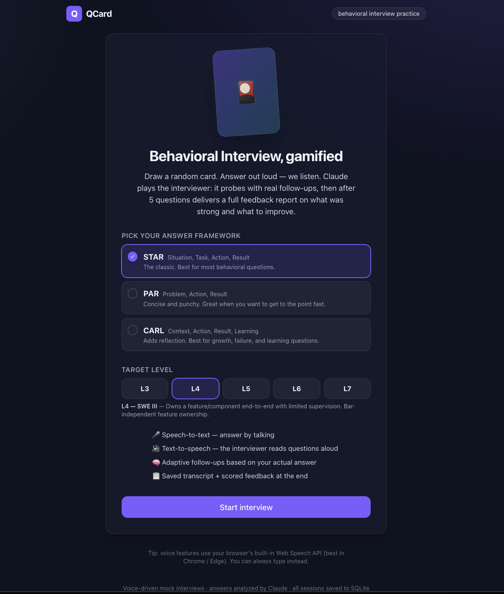
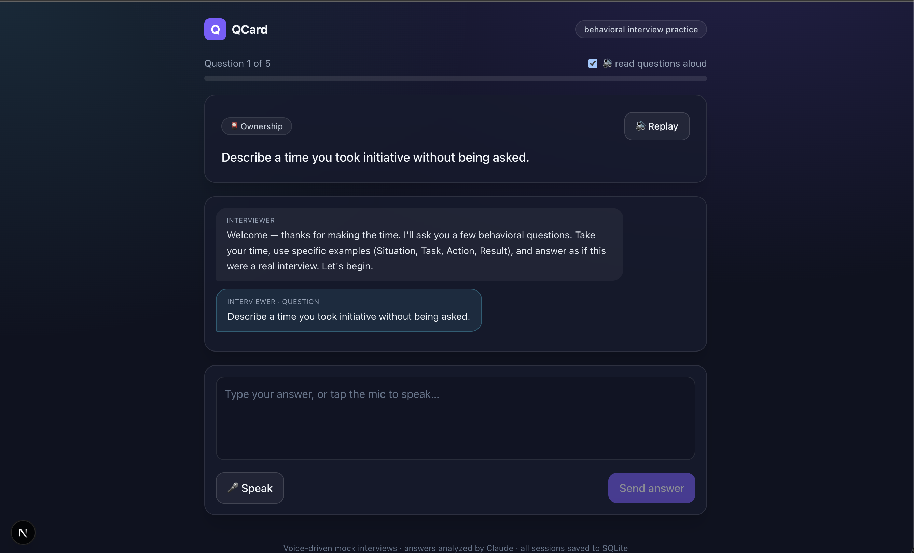

# 🎴 QCard — Behavioral Interview Card Game

A Next.js app that turns behavioral-interview prep into a card game. Draw a random
question card, answer **out loud**, and Claude plays the interviewer: it analyzes
each answer and asks realistic **follow-ups**. After 5 main questions it delivers a
scored **feedback report** — what was strong, what to improve, and what the
interviewer expected. Everything (sessions, questions, full conversation logs,
feedback) is persisted to **SQLite**.

## Screenshots

| Landing | Interview |
|---------|-----------|
|  |  |

- 🎤 **Speech-to-text** — answer by talking (Web Speech API)
- 🔊 **Text-to-speech** — the interviewer reads questions aloud
- 🧠 **Adaptive follow-ups** — generated from your actual answer (`claude-opus-4-8`)
- 🧩 **Pick your answer framework** — STAR, PAR, or CARL; the interviewer and feedback adapt to it
- 📋 **Persistent record** — every turn + feedback saved to SQLite

---

## Answer frameworks

At the start of a session you choose how you want to structure your answers. The choice is
stored on the session and rewrites the interviewer's system prompt **and** the final feedback
rubric ([`src/lib/methodologies.ts`](src/lib/methodologies.ts)).

| Framework | Components | Best for |
| --- | --- | --- |
| **STAR** | Situation · Task · Action · Result | The default — most behavioral questions. |
| **PAR** | Problem · Action · Result | Concise, punchy answers. |
| **CARL** | Context · Action · Result · Learning | Growth / failure / learning questions (probes reflection). |

The interviewer probes for whatever component is missing or vague — e.g. in **CARL** it will
specifically ask what you *learned* if you describe an outcome but never reflect on it. The
feedback report then scores your answers against that same framework.

---

## Requirements

- **Node.js ≥ 18.18** (Next.js 15 requirement). `.nvmrc` pins **22.21.1** — run `nvm use`.
  `better-sqlite3` is a native addon compiled for the Node it was installed under, so
  use one consistent Node version (see Troubleshooting).
- An **Anthropic API key** ([console.anthropic.com](https://console.anthropic.com/)).
  Without a key the app still runs end-to-end using built-in fallback follow-ups/feedback.
- Voice features work best in **Chrome / Edge** (Web Speech API). You can always type instead.

## Setup

```bash
nvm use                             # Node 22.21.1 (from .nvmrc) — important
npm install
cp .env.local.example .env.local    # then paste your ANTHROPIC_API_KEY
npm run db:seed                     # optional — DB also auto-seeds on first run
npm run dev                         # http://localhost:3000
```

`dev` / `start` / `db:seed` run a Node-version preflight ([scripts/check-node.mjs](scripts/check-node.mjs))
that stops with a clear message if Node is too old or the native binary doesn't match.

## How it works

```
Landing  ──POST /api/session──▶  pick 5 random cards, create session, log intro + first card
   │
Interview page (client)
   │  speak/type answer
   ├─ POST /api/answer  { sessionId, content }
   │     └─ log answer ─▶ Claude analyzes ─▶ { followup | next }
   │           followup → log follow-up, stay on card (max 2)
   │           next     → advance; log next card, or finish
   │
   └─ when 5 cards done → POST /api/feedback
         └─ Claude reads whole transcript ─▶ scored feedback ─▶ saved + shown
```

The interviewer prompt, follow-up cap, and feedback prompt live in
[`src/lib/anthropic.ts`](src/lib/anthropic.ts). The model returns **structured JSON**
(`output_config.format`) with **adaptive thinking**, so decisions are reliable to parse.

## Database (SQLite)

File: `data/qcard.db` (auto-created; WAL mode). Schema in
[`src/lib/db.ts`](src/lib/db.ts):

| Table | Purpose |
| --- | --- |
| `questions` | The card deck (category, text, difficulty). Seeded from [`questions.ts`](src/lib/questions.ts). |
| `sessions` | One interview: status, target main-question count, current index, **chosen framework** (`methodology`), timestamps. |
| `session_questions` | The 5 cards chosen for a session, their order, status, and follow-ups asked. |
| `messages` | **Full conversation log** — every interviewer line, candidate answer, and follow-up, tagged by `role` + `kind` and linked to its card. |
| `feedbacks` | Final report per session: strengths, improvements, expectations, overall, rating. |

```
sessions 1───∞ session_questions 1───∞ messages
sessions 1───∞ messages            (intro / feedback rows have null question)
sessions 1───∞ feedbacks
questions 1───∞ session_questions
```

## LLM providers (switchable)

The interviewer is backed by a pluggable provider layer ([`src/lib/llm/`](src/lib/llm)).
Pick one with `QCARD_PROVIDER`:

| Provider | `QCARD_PROVIDER` | Key | Default model | Key var |
| --- | --- | --- | --- | --- |
| Anthropic Claude | `anthropic` (default) | [console.anthropic.com](https://console.anthropic.com/) | `claude-opus-4-8` | `QCARD_ANTHROPIC_MODEL` |
| Google Gemini | `gemini` | [aistudio.google.com/apikey](https://aistudio.google.com/apikey) | `gemini-2.5-flash` | `QCARD_GEMINI_MODEL` |

Both use **schema-constrained JSON output** so decisions/feedback parse reliably
(Anthropic `output_config.format` + adaptive thinking; Gemini `responseSchema`,
thinking off on `flash` tiers). The active provider is shown as a chip in the UI.
If the selected provider has no key, the app falls back to built-in responses.

Switch example — in `.env.local`:

```bash
QCARD_PROVIDER=gemini
GEMINI_API_KEY=...
# QCARD_GEMINI_MODEL=gemini-2.5-pro
```

Add another provider by implementing the `JsonLLM` interface in
[`src/lib/llm/types.ts`](src/lib/llm/types.ts) and registering it in
[`src/lib/llm/index.ts`](src/lib/llm/index.ts).

## Configuration (env)

| Variable | Default | Meaning |
| --- | --- | --- |
| `QCARD_PROVIDER` | `anthropic` | LLM backend: `anthropic` or `gemini`. |
| `ANTHROPIC_API_KEY` | — | Key for the Anthropic provider. |
| `QCARD_ANTHROPIC_MODEL` | `claude-opus-4-8` | Claude model (also accepts legacy `QCARD_MODEL`). |
| `GEMINI_API_KEY` | — | Key for the Gemini provider (`GOOGLE_API_KEY` also read). |
| `QCARD_GEMINI_MODEL` | `gemini-2.5-flash` | Gemini model. |
| `QCARD_MAIN_QUESTIONS` | `5` | Main questions per interview. |
| `QCARD_MAX_FOLLOWUPS` | `2` | Max follow-ups the interviewer may ask per card. |
| `QCARD_DB_PATH` | `<projectRoot>/data/qcard.db` | SQLite file location. If the configured path doesn't exist, the app searches the project structure (anchored on `package.json`, from both cwd and the module dir) for an existing `qcard.db` before creating a new one — so it resolves correctly even when launched from another directory. |

## Project layout

```
src/
  app/
    page.tsx                  landing / start
    interview/[id]/page.tsx   interview screen
    api/
      session/route.ts        POST  create session
      session/[id]/route.ts   GET   load state
      answer/route.ts         POST  answer → analyze → follow-up / next
      feedback/route.ts       POST  generate + save feedback
  components/
    InterviewClient.tsx       chat UI, mic, TTS, progress
    FeedbackReport.tsx        final report
  hooks/useSpeech.ts          Web Speech API (STT + TTS)
  lib/
    db.ts                     SQLite schema + queries
    llm/
      index.ts                provider selection + analyze/feedback ops
      prompts.ts              shared prompts, schemas, fallbacks
      anthropic.ts            Anthropic (Claude) provider
      gemini.ts               Google Gemini provider
      types.ts                JsonLLM provider interface
    methodologies.ts          STAR / PAR / CARL frameworks + prompt guidance
    questions.ts              card bank
    state.ts                  build client state from DB
    types.ts                  shared types
```

## Voice quality (TTS)

The interviewer voice uses the browser's built-in voices, which vary a lot by browser/OS.
QCard auto-selects the most natural English voice available and offers a picker in the UI.

- **Best, no setup: use Chrome or Edge** — they ship neural "Google US English" / "Natural" voices.
- **Safari / macOS:** defaults to *Samantha*. For human-quality voices, download them once:
  **System Settings → Accessibility → Spoken Content → System Voice → Manage Voices →**
  English → pick a **Siri**, **(Enhanced)**, or **(Premium)** voice. They then appear in the
  dropdown and are auto-preferred. (macOS also ships novelty voices like *Zarvox* / *Bad News* —
  QCard filters those out so they're never auto-selected.)

## Troubleshooting

**`ERR_DLOPEN_FAILED` / "compiled against a different Node.js version" on Start Interview**
— `better-sqlite3`'s native binary is ABI-locked to the Node it was built under. You
installed under one Node and are running under another (common: nvm default is older
than the project Node). Fix:

```bash
nvm use                      # switch to .nvmrc (22.21.1), then re-run
# or, to use a different Node, rebuild the addon for it:
npm rebuild better-sqlite3
```

The `predev`/`prestart` guard now catches this before the server starts.

## Notes

- API routes run on the Node.js runtime (`better-sqlite3` is native); `next.config.mjs`
  marks it as a server-external package.
- The DB is created on first request — no manual migration step needed.

## License

MIT — see [LICENSE](LICENSE).
